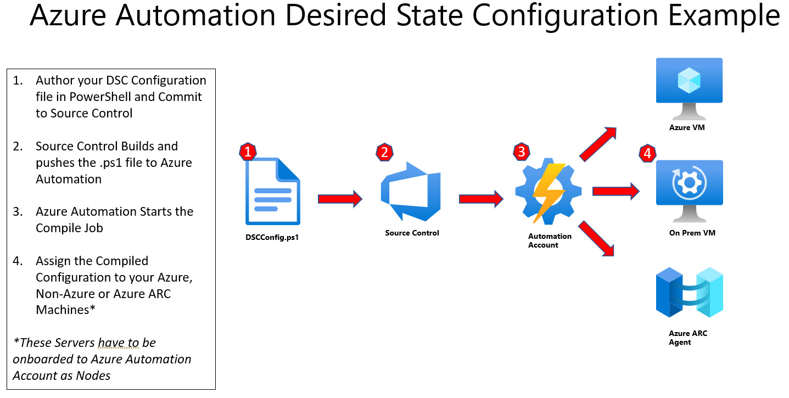

# Introduction 
This solution will allow you to use a Repo to store your Desired State Configurations and then use a Pipeline to push these configurations to Azure Automation Account DSC. The Automation account will comile your .ps1 files and you can then assign them to required nodes. 

# Design

# Pre-Requistes 
1.	Create an Azure Automation Account
2.	Create a DevOps Project
3.  Create a Service Connection for DevOps
4.	Modify the Parameters Labeled #TODO in the Yaml file and Create the Pipeline from the YAML file
# Getting Started
1.	Clone this Repo to your local Machine
2.	Write your configuration code and save it in Configurations Folder as a .ps1 File
3.	Commit your code to the repo. Upon Commit the code will kick off a build Pipeline and this will push the code to your Automation Account
4. You can then assign the Nodes in the Automation Account as required

# Enabling Physical/Virtual Linux Machine
[Microsoft Official Guidance](https://learn.microsoft.com/en-us/azure/automation/automation-dsc-onboarding#enable-physicalvirtual-linux-machines)

# Understanding the built-in resources

There are many great built-in resources that are ready to use. For more information refer to the below. 

[Windows](https://learn.microsoft.com/en-us/powershell/dsc/reference/resources/windows/archiveresource?view=dsc-1.1)
[Linux](https://learn.microsoft.com/en-us/powershell/dsc/reference/resources/linux/lnxarchiveresource?view=dsc-1.1)
